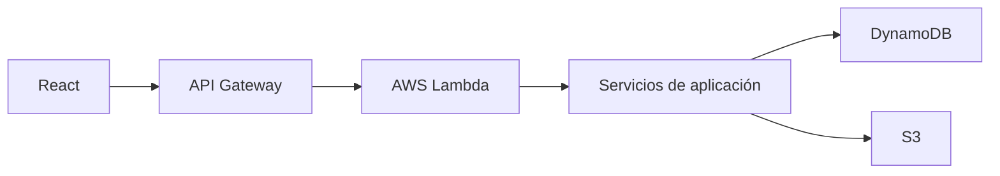

# PurchaseFlow

Sistema de gestión y aprobación de solicitudes de compra.

PurchaseFlow es una aplicación web serverless desarrollada como prueba técnica. Permite crear solicitudes, ejecutar un flujo verificable con tres aprobadores y conservar evidencia PDF de los procesos completados.

## 📋 Descripción

Cada solicitud de compra se crea con exactamente tres aprobadores. Cada uno recibe un enlace individual, un token individual y un OTP de seis dígitos con expiración de tres minutos. Las decisiones son independientes: tres aprobaciones completan la solicitud, mientras que cualquier rechazo la cierra inmediatamente. Cuando la solicitud alcanza un estado final (COMPLETED o REJECTED), se genera automáticamente una evidencia PDF con la trazabilidad del proceso.

## ✨ Características principales

- Creación y validación de solicitudes con exactamente tres aprobadores.
- OTP seguro de seis dígitos, expiración y reenvío con invalidación inmediata del código anterior.
- Aprobación, rechazo y bloqueo de decisiones posteriores.
- Demo Mailbox agrupado por solicitud y correo vigente por aprobador.
- Estados de solicitud y progreso individual de aprobación.
- Generación y descarga de evidencia PDF profesional.
- Interfaz responsive internacionalizada en español e inglés.
- Banco de 30 solicitudes válidas y carga aleatoria en el formulario.

## 🏗️ Arquitectura



El frontend React consume una HTTP API de API Gateway. Los handlers Lambda adaptan las solicitudes HTTP y delegan en servicios de aplicación. Repositories y adapters desacoplan el dominio de DynamoDB, S3, correo simulado y generación PDF. El composition root construye e inyecta las dependencias de producción.

## 🧰 Tecnologías

**Backend:** Node.js, TypeScript, AWS Lambda, API Gateway, DynamoDB, S3, AWS SDK v3, Serverless Framework, pdf-lib y Vitest.

**Frontend:** React, TypeScript, Vite, React Router, Testing Library y Vitest.

## 📂 Estructura del proyecto

```text
amm-technical-test/
├── backend/       # Dominio, servicios, adaptadores AWS, handlers y pruebas
├── frontend/      # Aplicación React, i18n, páginas, componentes y pruebas
└── README.md      # Documentación oficial
```

## 🔄 Flujo funcional

1. El usuario crea una solicitud con tres aprobadores.
2. El backend genera identificadores, token y OTP individual.
3. Se almacenan tres mensajes simulados.
4. El aprobador abre su enlace e ingresa el OTP.
5. Puede aprobar o rechazar.
6. La UI actualiza el progreso con el estado vigente.
7. Tres aprobaciones cambian la solicitud a `COMPLETED`.
8. Un rechazo cambia inmediatamente la solicitud a `REJECTED` y bloquea las demás decisiones.
9. Al completar el flujo se genera y almacena la evidencia PDF en S3.

Si un OTP expira, el aprobador puede reenviarlo. El sistema genera un OTP nuevo, conserva el enlace y vuelve inválido inmediatamente el código anterior.

## 📊 Estados

| Entidad | Estados persistidos |
|---|---|
| Solicitud | `PENDING`, `COMPLETED`, `REJECTED` |
| Aprobador | `PENDING`, `SIGNED`, `REJECTED` |

`CANCELLED` no pertenece al dominio: es una representación visual para aprobadores aún `PENDING` cuando la solicitud ya fue rechazada. `SIGNED` se presenta visualmente como “Aprobado”.

## 🔐 Seguridad

- Los Response DTO no exponen OTP, `accessToken` ni `otpExpiresAt`.
- Cada aprobador tiene token y OTP individuales con expiración.
- Los errores HTTP evitan filtrar detalles internos, stack traces o datos AWS.
- El bucket S3 es privado y bloquea acceso público.
- IAM se limita a tablas, bucket y acciones requeridas; no utiliza `Resource: "*"`.
- Las decisiones duplicadas y solicitudes cerradas son rechazadas por el backend.

> ⚠️ `/mock-mail` es una herramienta exclusiva de demostración y no debería estar disponible públicamente en producción.

## 📧 Demo Mailbox

Simula un proveedor de correo para probar el flujo completo sin integrar SES o SMTP. Agrupa los mensajes por solicitud, muestra el estado actual y, si se reenvía un OTP, conserva el correo más reciente como activo.

## 📄 Evidencia PDF

Se genera cuando la solicitud alcanza un resultado final: `COMPLETED` o `REJECTED`. Contiene datos de la solicitud, trazabilidad, resumen y decisiones reales de los aprobadores; nunca incluye OTP ni tokens. Se almacena de forma privada en S3 y se descarga mediante el endpoint de evidencia.

Las evidencias existentes en S3 no se migran ni se regeneran automáticamente: conservan el diseño con el que fueron creadas. Para validar el diseño vigente debe utilizarse una solicitud nueva creada después del despliegue de esta versión.

## 🌐 Internacionalización

La interfaz usa diccionarios TypeScript tipados y React Context, sin librerías externas de i18n. Español es el idioma predeterminado y el header permite cambiar a inglés. Fechas y números usan `es-CO` o `en-US` según el idioma.

## ☁️ Infraestructura AWS

`backend/serverless.yml` define HTTP API de API Gateway, funciones Lambda, tablas DynamoDB, bucket S3 privado, permisos IAM y recursos CloudFormation generados por Serverless Framework.

## 🔌 API

| Método | Ruta | Descripción |
|---|---|---|
| POST | `/api/solicitudes` | Crea una solicitud |
| GET | `/api/solicitudes` | Lista solicitudes |
| GET | `/api/solicitudes/{id}` | Consulta una solicitud |
| POST | `/api/solicitudes/{id}/validate-otp` | Valida OTP y token |
| POST | `/api/solicitudes/{id}/resend-otp` | Regenera y reenvía el OTP |
| POST | `/api/solicitudes/{id}/approve` | Registra aprobación |
| POST | `/api/solicitudes/{id}/reject` | Registra rechazo |
| GET | `/api/solicitudes/{id}/evidencia.pdf` | Descarga evidencia PDF |
| GET | `/mock-mail` | Consulta correo simulado; admite `requestId` |

## 📘 Documentación de API

La especificación OpenAPI 3.0.3 está disponible en `backend/docs/openapi.yaml`. Puede visualizarse o importarse en herramientas compatibles con OpenAPI 3, como Swagger Editor o Postman.

Para probar la API desde una de estas herramientas:

1. Abra `backend/docs/openapi.yaml` en una herramienta compatible con OpenAPI 3, como Swagger Editor o Postman.
2. Seleccione el servidor “AWS - Ambiente de demostración (dev)”.
3. Ejecute primero `GET /api/solicitudes`.
4. También puede consultar `GET /mock-mail`.
5. Para ejecutar `GET /api/solicitudes/{id}`, utilice un ID retornado previamente por `GET /api/solicitudes`.
6. Los endpoints de aprobación requieren respetar el flujo completo mediante el token individual y un OTP vigente.

## 🌎 Ambiente de demostración

Backend API - AWS API Gateway:

`https://zotl5cs229.execute-api.us-east-1.amazonaws.com`

Especificación OpenAPI: `backend/docs/openapi.yaml`

El backend está desplegado en el ambiente `dev` de AWS y utiliza API Gateway, Lambda, DynamoDB y S3. La especificación OpenAPI incluye este ambiente como servidor principal para ejecutar solicitudes desde herramientas compatibles. El endpoint `/mock-mail` es exclusivamente una herramienta de demostración y no debe exponerse públicamente en producción.

El frontend puede continuar ejecutándose localmente siguiendo las instrucciones de este README.

## ⚙️ Variables de entorno

Backend: `PURCHASE_REQUESTS_TABLE`, `MOCK_MAIL_TABLE` y `EVIDENCE_BUCKET` son configuradas por Serverless; `FRONTEND_BASE_URL` define la base de los enlaces y `AWS_REGION` la región. Frontend: `VITE_API_BASE_URL` apunta a la API. No deben almacenarse credenciales AWS en archivos `.env`.

## 🚀 Ejecución local

```bash
cd backend
npm install
npm run typecheck
npm test
npm run build
```

```bash
cd frontend
npm install
npm run typecheck
npm test
npm run build
npm run dev
```

Copie `frontend/.env.example` como `.env` y configure `VITE_API_BASE_URL`, por ejemplo `http://localhost:3000` para desarrollo local.

## ☁️ Despliegue

Requiere AWS CLI configurada y autenticación válida de Serverless Framework:

```bash
aws sts get-caller-identity
cd backend
npm run deploy -- --stage dev --region us-east-1
```

No se incluyen Account IDs, credenciales ni tokens en el repositorio.

## 🧪 Pruebas automatizadas

Resultados finales locales:

- Backend: 46 pruebas aprobadas.
- Frontend: 78 pruebas aprobadas.
- Total: 124 pruebas automatizadas aprobadas.

Los umbrales mínimos de cobertura configurados son 60 % para statements, branches, functions y lines. No se publican porcentajes en esta sección porque no corresponden a una ejecución de cobertura vigente.

## 🧪 Cómo probar manualmente

1. Inicie el frontend y cree una solicitud, manualmente o con “Cargar datos de prueba”.
2. Abra Demo Mailbox, expanda un correo y abra la aprobación.
3. Ingrese el OTP y apruebe; repita con los tres aprobadores.
4. Compruebe `COMPLETED` y descargue la evidencia PDF.
5. En otro caso, rechace una aprobación y confirme el bloqueo de las restantes.
6. Espere la expiración, reenvíe el OTP y use el correo más reciente.
7. Cambie entre ES y EN desde el header.

## 🧠 Decisiones técnicas

- Arquitectura desacoplada y repository pattern para aislar persistencia.
- Dependency injection mediante composition root explícito.
- DTO seguros para separar entidades internas de respuestas HTTP.
- S3 para evidencia durable y privada.
- pdf-lib para generar PDF sin navegador ni runtime pesado.
- Serverless Framework para infraestructura reproducible.
- Implementaciones in-memory para pruebas rápidas.
- Separación clara entre frontend y backend.

## ⚠️ Limitaciones conocidas / mejoras futuras

- Incorporar autenticación y autorización empresarial real.
- Proteger o eliminar `/mock-mail` en producción e integrar SES/SMTP.
- Añadir GSI para consultas de correo sin Scan.
- Procesar evidencia de manera asíncrona en cargas elevadas.
- Reforzar idempotencia distribuida y escrituras condicionales/atómicas en DynamoDB.
- Restringir CORS al origen productivo.
- Definir hosting y distribución CDN del frontend.

### Vite en lugar de Webpack

Aunque Webpack se encontraba dentro de la stack recomendada, se utilizó
Vite como herramienta de construcción del frontend.

Para el alcance actual no se identificó una necesidad real de implementar
Module Federation o una arquitectura de microfrontends. Vite permitió
reducir configuración, mantener un ciclo de desarrollo rápido y generar
un bundle optimizado, conservando React, React Router y la arquitectura
cliente-servidor requerida.

La decisión busca evitar complejidad accidental sin aportar dependencias
arquitectónicas que el dominio actualmente no requiere


## 👩‍💻 Autor

Tatiana Garcia Contreras  
PurchaseFlow v1.0  
Copyright © 2026 Tatiana Garcia Contreras
